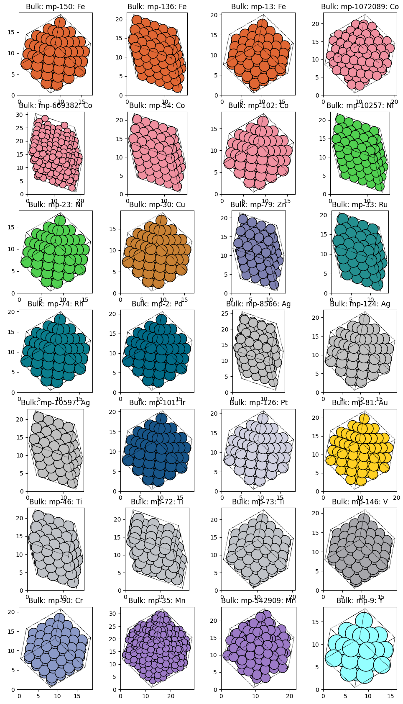
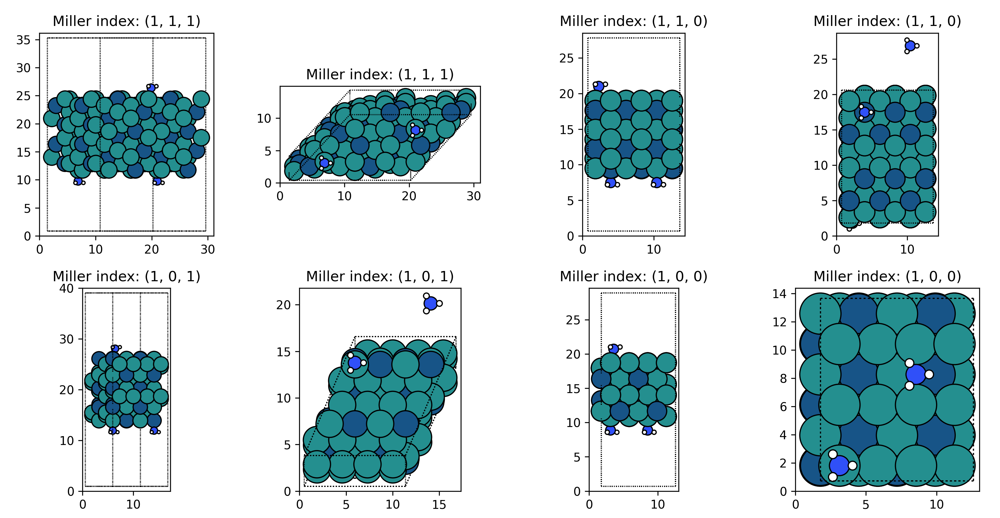

# generation

This section is responsible for generating structures, including bulk and slab structures for VASP calculation.

## Table of Contents

- [0. Prerequisites](#0-prerequisites)
- [1. element_list.json](#1-element_listjson)
- [2. molecule.json](#2-moleculejson)
- [3. material.json](#3-materialjson)
- [4. get-bulk.py](#4-get-bulkpy)
- [5. get-slab.py](#5-get-slabpy)
- [6. Acknowledgements](#6-acknowledgements)

## 0. Prerequisites

- Python 3 (version > 3.10)
- ASE (Atomic Simulation Environment, version > 3.22)
- Pymatgen (version > 2023.3.23)
- MP-API (version > 0.41.2)
- Numpy (version > 1.22.3)

## 1. element_list.json

The [element_list.json](./element_list.json) file contains the list of metal (metal_element_list) and alloy (alloy_element_list) elements, and this file is mainly read by [get-bulk.py](./get-bulk.py) script for bulk materials (including pure metals, binary alloys, and ternary alloys, etc.) search and generation. In actual application, you can add or delete`metal` or `alloy` elements according to your needs.

## 2. molecule.json

The [molecule.json](./molecule.json) file contains information about 50 molecules or intermediates, including the elemental composition and coordinates of the molecule. This json file is mainly read by [get-slab.py](./get_slab.py) script for the generation of surface adsorption structures. In actual application, you can add or delete adsorbates according to your needs.


## 3. material.json

The [material.json](./material.json) file mainly consists of five parts: `reactions`, `type1`, `type2`, `type3` and `type4`, among which `reactions` is a subset of `type3`. The following is a detailed explanation of these five sections:

- `reactions`: The section contains 13 different catalytic reactions, each of which consists of four to six characteristic reaction intermediates (or adsorbates). For example, the reaction of `CO_Oxidation` involves four adsorbates: "O2", "O", "CO", and "CO2".
- `type1`: This section is mainly composed of 42 common metals and binary alloys, and each metal and alloy corresponds to different adsorbates.
- `type2`: This part contains 599 different metals and alloys.
- `type3`: This part consists of 12 different metals and corresponding characteristic reactions defined in the section `reactions`.
- `type4`: The list of metal elements searched by [get-bulk.py](./get-bulk.py) script, and this section is read by [get-bulk.py](./get-bulk.py) to generate metal bulks for the construction of database.

In actual application, you can add or delete `reactions` or `types` according to your needs.

## 4. get-bulk.py

## 4.1 Command-Line Arguments

This script supports the following command-line arguments:

- `--plot` (type: `bool`, default: `False`): Enable plotting of metal or alloy structures based on bulk generation. It is recommended to turn this boolean on when generating bulk structures.
- `--api-key` (type: `str`, default: `Your-Api-Key`): The Materials Project API key. Replace this string with your own API key when using this script.
- `--min-lw` (type: `float`, default: `10.0`): The value defines the minimum length of the three vectors *a*, *b*, and *c* in the generating bulk structures.
- `--bulktype` (type: `str`, default: `metal`): The bulk types selected to search or generate bulk structures. There are three options, which are `metal`, `alloy` and `oxide`.
- `--elementNumber` (type: `int`, default: `2`): The number of element types of alloy. When the `bulktype` is `metal`, the value should be `1`, and for binary and ternary alloy the value is `2` and `3`, respectively.
- `--task` (type: `str`, default: `generate`): This bulk types selected to search or generate bulk structures. There are two options, which are `search` and `generate`.
- `--abovehull` (type: `float`, default: `0.3`): This value reprsents the energy scope for structure search, which is corresponding to the `energy_above_hull` in Materials Project.
- `--ifiscd` (type: `bool`, default: `False`): icsd true means only experimental strcutures, theoretical means include all possible structures include the material does not match any known ICSD entries.

## 4.2 Example Command

To run the script, use the following command:

```
python get-bulk.py --api-key Your-Api-Key --bulktype metal --elementNumber 1 --task search --ificsd
```

This command means searching for pure metals with specific properties, and will write a [metal_mp_ids.json](../docs/metal_mp_ids.json) file, which can be used as `type4` in [material.json](./material.json) for metal generation. It should be noted that for the same metal searched, multiple different structures may be obtained.

```
python get-bulk.py --api-key Your-Api-Key --bulktype alloy --elementNumber 2 --task search --abovehull 0.0 --ificsd
```

This command means searching for binary alloys with specific properties, and will write a [alloy_mp_ids.json](../docs/alloy_mp_ids.json) file, which can be used as `type4` in [material.json](./material.json) for binary alloy generation. It should be noted that for the same binary alloy searched, multiple different structures may be ontained.

```
python get-bulk.py --plot --api-key Your-Api-Key --min-lw 10.0 --task generate
```

This command means generating bulk structures saved at `type4` in `material.json` file. Please note that here we use the structures generated above stored in [metal_mp_ids.json](../docs/metal_mp_ids.json) file, and you need to adjust it according to your needs in actual application.



## 5. get-slab.py

## 5.1 Command-Line Arguments

This script supports the following command-line arguments:

- `--plot` (type: `bool`, default: `False`): Enable plotting of top view of slabs and its adsorption sites based on slab generation. It is recommended to turn this boolean on when generating slab structures.
- `--api-key` (type: `str`, default: `Your-Api-Key`): The Materials Project API key. Replace it with your own API key when using this script.
- `--molecule-type` (type: `str`, default: `NH3`): Type of molecules or adsorbates to adsorb on the slab surface. It should be noted that the selected `molecule-type` must be defined in the [molecule.json](./molecule.json) file.
- `--up-down` (type: `str`, default: `UUD`): Indicator of where to adsorb molecules or adsorbates on the slab surface. There are five choices, which are `U`, `D` , `UD`, `UUD` and `UUUUDDDD`. `U` represents the molecules or adsorbates adsorbed on the upper surface of slab (i.e. up), whereas `D` for the adsorption on the bottom surface (i.e. down). `UD` for both surfaces, `UUD` for two up and one down, `UUUUDDDD` for `type3` to generate different molecules or adsorbates combination on top and bottom surface. It is worth noting that for the type `UUUUDDDD`, there are $C(n, 4)$ combinations of adsorbates on each metal or alloy surface, where *n* is the number of adsorbates in corresponding `reactions` defined in [material.json](./material.json).
- `--max-index` (type: `int`, default: `2`): The maximum Miller index to consider for slab generation.
- `--min-slab-size` (type: `float`, default: `8.0`): The minimum size of the generating slab.
- `--min-vacuum-size` (type: `float`, default: `15.0`): The minimum size of the vacuum layer of slab.
- `--min-lw` (type: `float`, default: `10.0`): The value defines the minimum length of the vectors *a*, and *b* in the generating slab structures.
- `--distance` (type: `float`, default: `2.0`): This value means the distance between adsorbates and slab surface.
- `--element` (type: `str`, default: `Au`): The chemical formula of the metals or alloys to generate slab structures. It should be noted that the selected `element` must be defined in the [material.json](./material.json) file.
- `--max-slabs` (type: `int`, default: `6`): The maximum number of slabs to generate per metal or alloy.
- `--type` (type: `str`, default: `type1`): This parameter reprsents selecting which type of materials group in [material.json](./material.json). There are four options in [material.json](./material.json): `type1`, `type2`, `type3` and `type4`.

## 5.2 Example Command

To run the script, use the following command:

```
python get-slab.py --plot --api-key Your-Api-Key --molecule-type CO --up-down UUD --element Au --type type1
```
This command means generating 6 slabs with CO molecule adsorbed on six Au surfaces, including (100), (110), (111), (210), (211) and (221), where two CO molecules locate at the upper suface and one on the bottom surface.


```
python get-slab.py --plot --api-key Your-Api-Key --molecule-type all --up-down UUD --element RuIr --max-slabs 4 --type type1
```

This command means generating 76 slabs with 19 molecules defined in [material.json](./material.json) adsorbed on four RuIr alloy surfaces, including (100), (101), (110) and (111), where two molecules locate at the upper suface and one on the bottom surface.



```
python get-slab.py --plot --api-key Your-Api-Key --molecule-type all --up-down UUUUDDDD --element Pd --max-slabs 1 --type type3
```

For metal Pd there are four corresponding `reactions` defined in [material.json](./material.json), including `C2H2_Hydrogenation`, `ORR_OER`, `HER_HOR` and `Waterinterface`, each of which contains 5, 5, 4, and 4 adsorbates respectively, relusting in 5, 5, 1, and 1 comninations for each reaction. Therefore, this command will generate 12 slabs for Pd(100) surface, where four adsorbates locate at the upper suface and four on the bottom surface.


## 6. Acknowledgements

* Python: [https://www.python.org/]()
* ASE: [https://wiki.fysik.dtu.dk/ase/]()
* Pymatgen: [https://pymatgen.com/]()
* MP-API: [https://pypi.org/project/mp-api/]()
* Numpy: [https://numpy.org/]()
