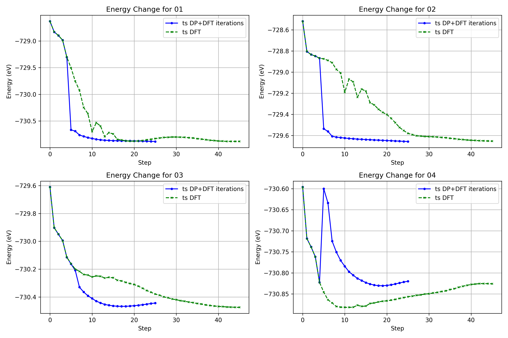

# postworkflow

Aims of flowopt.py and flowts.py are reducing the ionic steps of optimization and transition state calculations, to avoid computational cost of SCF step,

## Table of Contents

- [0. Prerequisites](#0-prerequisites)
- [1. flowopt.py](#1-flowoptpy)
  - [1.1 flowopt.py File Structure](#11-flowoptpy-file-structure)
  - [1.2 flowopt.py Usage](#12-flowoptpy-usage)
    - [1.2.1 Command-Line Arguments](#121-command-line-arguments)
    - [1.2.2 Example Command](#122-example-command)
  - [1.3 Workflow Description for flowopt.py](#13-workflow-description-for-flowoptpy)
  - [1.4 Resuming from Checkpoints](#14-resuming-from-checkpoints)
  - [1.5 Notes for flowopt.ts](#15-notes-for-flowoptts)
- [2. flowts.py](#2-flowtspy)
  - [2.1 flowts.py File Structure](#21-flowtspy-file-structure)
  - [2.2 flowts.py Usage](#22-flowtspy-usage)
    - [2.2.1 Command-Line Arguments](#221-command-line-arguments)
    - [2.2.2 Example Command](#222-example-command)
  - [2.3 Workflow Description for flowts.py](#23-workflow-description-for-flowtspy)
  - [2.4 Resuming from Checkpoints](#24-resuming-from-checkpoints)
- [3. License](#3-license)
- [4. Acknowledgements](#4-acknowledgements)


## 0. Prerequisites

- Python 3 (version > 3.10)
- ASE (Atomic Simulation Environment, version > 3.22)
- VASP (Vienna Ab initio Simulation Package)
- DeepMD-kit (version > 3.0.0a1)
- dpdata (version > 0.2.18)
- VASPkit
- SLURM (for job scheduling)


## 1. flowopt.py

flowopt.py script performs an iterative optimization and fine-tuning workflow using ASE (Atomic Simulation Environment) and VASP (Vienna Ab initio Simulation Package) with DeepMD-kit. The workflow involves optimizing atomic structures, running VASP calculations, generating new datasets for finetune, and fine-tuning machine learning models iteratively. After completing the specified number of iterations, a final VASP optimization step is performed to get accurate configuration and energy.


## 1.1 flowopt.py File Structure

```
.
├── flowopt.py # Main script for the workflow
├── POSCAR # initial structure for opt
├── utils
│ ├── INCAR # VASP input file for OPT `NSW = 3`
│ ├── POTCAR # VASP pseudopotentials file
│ ├── KPOINTS # VASP k-points file
│ ├── sub.vasp # VASP submission script, slurm
│ ├── finetune1.json # Fine-tuning configuration template
│ └── sub.dp # DeepMD-kit submission script, slurm
└── record.txt # File to record the progress of the workflow for restart
```

## 1.2 flowopt.py Usage

1. Ensure all prerequisites are installed and configured correctly.
2. Prepare the necessary input files (`INCAR`, `KPOINTS`, `sub.vasp`, `finetune1.json`, `sub.dp`, `POTCAR`) in the `utils` directory.
3. Place the initial atomic structure file (`POSCAR`) in the working directory.
4. Run the script with the desired parameters.

### 1.2.1 Command-Line Arguments

This script supports the following command-line arguments:

- `--num_iterations` (type: `int`, default: `4`): The number of optimization and finetuning iterations to run. Each iteration consists of optimizing the structure using ASE, running a VASP calculation, generating a new dataset, and finetuning the model.
- `--steps_per_iteration` (type: `int`, default: `100`): The number of training, i.e. "numb_steps" parameter in finetune.json, steps to perform during each finetuning iteration. This value will be multiplied by the iteration number to determine the total number of training steps for each iteration. for example: if --steps_per_iteration 100, numb_steps will be 100, 200, 300, 400 in finetune1, finetune2, finetune3, finetune4, respectively.
- `--fixed_atoms` (type: `int`, default: `0`): The number of atoms to fix in position during the structure optimization step. The lowest atoms based on their z-coordinate will be fixed.
- `--iffinal` (type: `bool`, default: `True`): Whether to perform the final optimization step. This step is carried out after the last iteration and includes an additional structure optimization and VASP calculation. Usually, it is necessary to keep --iffinal true to get an accurate final energy and configuration.
- `--skip_first_opt` (type: `bool`, default: `False`): Whether to skip the first optimization step. If set to `True`, the script will directly use the initial `POSCAR` file for the first VASP calculation without performing the initial structure optimization by ASE with DP potential. Usually, if the training set of large atomic model include similar structureof POSCAR, it recommand to use --skip_first_opt false to get faster result. if the POSCAR is a new system, it recommand to use --skip_first_opt true to do VASP optimization of several step to get some dataset for finetune.
- `--fmax` (type: `float`, default: `0.2`): The maximum force criterion for structure optimization by ase with DP potential. The optimization will stop when the forces on all atoms are below this threshold.

### 1.2.2 Example Command

To run the script, use the following command:

```sh
python script_name.py [--num_iterations NUM] [--steps_per_iteration NUM] [--fixed_atoms NUM] [--iffinal BOOL] [--skip_first_opt BOOL]
```

```bash
for in-domain system:
nohup python script.py --num_iterations 3 --steps_per_iteration 200 --fixed_atoms 0 --iffinal true --skip_first_opt false --fmax 0.1 &
for out-of-domain system:
nohup python script.py --num_iterations 5 --steps_per_iteration 200 --fixed_atoms 0 --iffinal true --skip_first_opt true --fmax 0.2 &
```

## 1.3 Workflow Description for flowopt.py
```mermaid
graph TD
A[start] -->|skip_first_opt?| X{skip first?}
X -.no.-> B[ase optimization with DP potential]
X -.yes.-> C[VASP optimization by NSW=3 step]
B --get CONTCAR--- C[VASP optimization by NSW=3 step]
C  -->D[collect data by dpdata]
D --> E[finetune with new data by DeePMD-kit]
E --> F{if num_iterations}
F -.yes.-> G{if final}
F -.no.-> B
G-.yes.-> H(final VASP optimization with DFT)
G-.no.-> I(end)
H --> I
```

The script follows these main steps:

1. **Optimization of Atomic Structures by ASE** :
   * Optimizes the atomic structure using catalyticLAM DeepMD-kit models.
   * Saves the optimized structure as `CONTCAR-ase-{iteration}`.
2. **Preparation for VASP Calculation** :
   * Creates a new directory for each iteration (`opt{iteration}`).
   * Copies the optimized structure and necessary VASP input files to the new directory.
   * If not the first iteration, copies `WAVECAR` and `CHGCAR` from the previous iteration.
3. **Run VASP Calculation** :
   * Submits the VASP job and retrieves the job ID.
   * Waits for the VASP job to complete.
4. **Generate New Dataset** :
   * Generates a new dataset from the VASP output file `OUTCAR` by dpdata.
   * Saves the dataset in the specified directory.
5. **Fine-Tuning of Models** :
   * Updates the fine-tuning configuration (`finetune1.json`) with new data paths and iteration-specific parameters.
   * Submits the fine-tuning job and retrieves the job ID.
   * Waits for the fine-tuning job to complete.
6. **Freezing the Model** :
   * Freezes the fine-tuned model using DeepMD-kit.
7. **Final Optimization Step** :
   * After completing all iterations, runs a final optimization step.
   * Creates a new directory (`optfinal`) and copies the final optimized structure.
   * Modifies the `INCAR` file to set `NSW = 300`.
   * Submits the final VASP job and waits for its completion.

## 1.4 Resuming from Checkpoints

The script records the progress of each step in `record.txt`. If the script is interrupted, it can resume from the last completed step by reading the `record.txt` file.
examples of `record.txt`

```
aseopt1
vaspopt1
dpdata1
finetune1
freeze1
aseopt2
vaspopt2
dpdata2
finetune2
freeze2
```

## 1.5 Notes for flowopt.ts

* Ensure the VASP and DeepMD-kit executables are accessible in your environment.
* Customize the `INCAR`, `KPOINTS`, `POTCAR`, and submission scripts (`sub.vasp`, `sub.dp`) as needed for your specific system and requirements.
* Adjust the polling interval in `wait_for_job_completion` if necessary.


## 2. flowts.py

flowts.py script performs an iterative NEB calculation and fine-tuning workflow using ASE (Atomic Simulation Environment) and VASP (Vienna Ab initio Simulation Package) with DeepMD-kit. The workflow involves ase-CINEB calculations, running VASP-CINEB calculations, generating new datasets for finetune, and fine-tuning machine learning models iteratively. After completing the specified number of iterations, a final VASP-CINEB step is performed to get accurate transition states configuration and energy.




## 2.1 flowts.py File Structure
```
.
├── flowts.py # Main script for the workflow
├── POSCARis # initial structure for NEB calculation (POSCAR format)
├── POSCARfs # final structure for NEB calculation (POSCAR format)
├── OUTCARis # initial structure's opt OUTCAR
├── OUTCARfs # final structure's opt OUTCAR
├── utils
│ ├── INCAR # VASP input file for CINEB NSW = 3
│ ├── POTCAR # VASP pseudopotentials file
│ ├── KPOINTS # VASP k-points file
│ ├── sub.vasp # VASP submission script, slurm
│ ├── finetune1.json # Fine-tuning configuration template
│ └── sub.dp # DeepMD-kit submission script, slurm
└── record.txt # File to record the progress of the workflow for restart
```

## 2.2 flowts.py Usage

1. Ensure all prerequisites are installed and configured correctly.
2. Prepare the necessary input files (`INCAR`, `KPOINTS`, `sub.vasp`, `finetune1.json`, `sub.dp`, `POTCAR`) in the `utils` directory.
3. Place the initial and final atomic structure files (`initial_structure`, `final_structure`) in the working directory.
4. Place the initial and final opt OUTCAR (`initial_opt_OUTCAR`, `final_opt_OUTCAR`) in the working directory.
5. Run the script with the desired parameters.

### 2.2.1 Command-Line Arguments

This script supports the following command-line arguments:

- `initial_structure` (type: `str`): Path to the initial structure (POSCAR format).
- `final_structure` (type: `str`): Path to the final structure (POSCAR format).
- `model_path` (type: `str`): Path to the DeepMD model.
- `initial_outcar` (type: `str`): Path to the initial OUTCAR file.
- `final_outcar` (type: `str`): Path to the final OUTCAR file.
- `--num_steps` (type: `int`, default: `1`): Number of steps to run.
- `--n_images` (type: `int`, default: `4`): Number of intermediate images.
- `--fmax` (type: `float`, default: `0.5`): Maximum force criteria for optimization.
- `--interpolation` (choices: `['linear', 'idpp']`, default: `linear`): Interpolation method for generating intermediate images.
- `--spring_constant` (type: `float`, default: `1.0`): Spring constant for NEB calculations.
- `--steps_per_iteration` (type: `int`, default: `1000`): Number of steps per iteration.
- `--apply_constraint` (type: `bool`, default: `False`): Whether to apply constraints during interpolation.
- `--skip_first_neb` (action: `store_true`): Skip the first ASE NEB optimization.

### 2.2.2 Example Command

To run the script, use the following command:

```sh
python script_name.py initial_structure final_structure model_path initial_outcar final_outcar [--num_steps NUM] [--n_images NUM] [--fmax NUM] [--interpolation METHOD] [--spring_constant NUM] [--steps_per_iteration NUM] [--apply_constraint BOOL] [--skip_first_neb]
```
```sh
nohup python ./flowts.py POSCARis POSCARfs ./frozen_model.pth OUTCARis OUTCARfs &
```


## 2.3 Workflow Description for flowopt.py 
```mermaid
graph TD
A[start] -->|skip_first_neb?| X{skip first?}
X -.no.-> B[ASE CINEB optimization]
X -.yes.-> C[VASP NEB optimization]
B -->|get CONTCAR0*| C
C --> D[collect data]
D --> E[finetune with new data]
E --> F{num_steps?}
F -.yes.-> H[final VASP NEB optimization]
F -.no.-> B
H --> I[end]
```

The script follows these main steps:

1. **NEB Calculation (ASE)** :
   * Generates intermediate images using the initial and final structures.
   * Optimizes the NEB path using DeepMD-kit models.
   * Saves the optimized structures as `CONTCAR{n}`.
2. **Preparation for VASP Calculation** :
   * Creates a new directory for each step (`ts{step}`).
   * Copies the optimized structures and necessary VASP input files to the new directory.
3. **Run VASP NEB Calculation** :
   * Generates the `POTCAR` file using VASPkit.
   * Submits the VASP job and retrieves the job ID.
   * Waits for the VASP job to complete.
4. **Generate New Dataset** :
   * Generates a new dataset from the VASP output files `OUTCAR`.
   * Saves the dataset in the specified directory.
5. **Fine-Tuning of Models** :
   * Updates the fine-tuning configuration (`finetune1.json`) with new data paths and iteration-specific parameters.
   * Submits the fine-tuning job and retrieves the job ID.
   * Waits for the fine-tuning job to complete.
6. **Freezing the Model** :
   * Freezes the fine-tuned model using DeepMD-kit.
7. **Final NEB Calculation** :
   * After completing all steps, runs a final NEB calculation.
   * Creates a new directory (`tsfinal`) and copies the final optimized structures.
   * Modifies the `INCAR` file to set `NSW = 300`.
   * Submits the final VASP job and waits for its completion.

## 2.4 Resuming from Checkpoints

The script records the progress of each step in `record.txt`. If the script is interrupted, it can resume from the last completed step by reading the `record.txt` file.
examples of `record.txt`
```
vaspopt1
finetune1
freeze1
vaspopt-final

```

## 3. License

This project is licensed under the LGPL-3.0 License.

## 4. Acknowledgements

* ASE: [https://wiki.fysik.dtu.dk/ase/]()
* VASP: [https://www.vasp.at/](https://www.vasp.at/)
* DeepMD-kit: [https://github.com/deepmodeling/deepmd-kit](https://github.com/deepmodeling/deepmd-kit)
* dpdata: [https://github.com/deepmodeling/dpdata](https://github.com/deepmodeling/dpdata)
* VASPkit: [https://vaspkit.com/](https://vaspkit.com/)
* SLURM: [https://slurm.schedmd.com/]()

